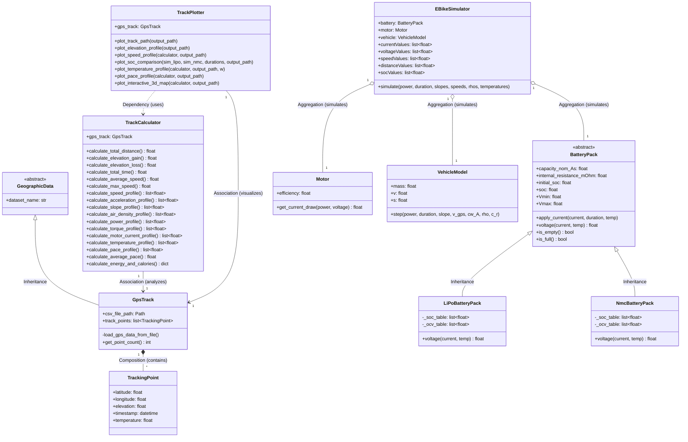

# E-Bike Auslegungs- und Simulationsanwendung (Abschlussprojekt Programmieren I)

**Entwickelt von:** Gabriel Rauchfuß und Leon Traxler

Dieses Repository enthält unsere Python-Anwendung, die als kollaboratives Projekt (via GitHub) im Rahmen des Abschlussprojekts für das Modul *Programmieren I* entstanden ist. Das Programm dient der physikalischen Auslegung und Simulation eines E-Bikes auf Basis realer GPS-Daten. Es berechnet Fahrwiderstände, wertet Strecken- und Pace-Profile aus und simuliert detailliert das Entladeverhalten verschiedener Akkumodelle unter wechselnden Umgebungsbedingungen.

---

## 🛠️ Installation & Ausführung

### Voraussetzungen
Für die Ausführung wird **Python 3.10** oder neuer benötigt.

1. **In den Projektordner wechseln:**
   ```bash
   cd Abschlussprojekt_LT_GR_Programmieren_I
   ```

2. **Virtuelle Umgebung aktivieren:**
   * **Windows (PowerShell):**
     ```powershell
     .\.venv\Scripts\Activate.ps1
     ```
   * **macOS/Linux:**
     ```bash
     source .venv/bin/activate
     ```

3. **Abhängigkeiten installieren:**
   ```bash
   pip install -r requirements.txt
   ```

4. **Simulation starten:**
   ```bash
   python main.py
   ```

---

## 🔄 Ablauf der Simulation (UML-Aktivitätsdiagramm)

Der folgende Ablaufplan visualisiert die wesentlichen Schritte der Simulation, vom Einlesen der GPS-Daten bis zur Ausgabe der grafischen Auswertungen:

```mermaid
flowchart TD
    %% UML Start and End Nodes
    StartNode(( )) ---> SelectFile(Select GPS CSV File via Picker)
    
    SelectFile --> ParseCSV(Parse CSV into GPS Track Points)
    ParseCSV --> CalcProfiles(Calculate Profiles: Power, Slopes, Speeds, Rhos, Temps, Pace)
    CalcProfiles --> InitSim(Initialize Vehicles & Motors)
    
    %% Parallel Fork (UML Fork Bar)
    InitSim --> ForkBar[ ]
    style ForkBar fill:#000,stroke:#000,height:8px,width:250px
    
    %% Parallel Path 1: LiPo
    ForkBar -->|"[Simulate LiPo]"| InitLiPo(Initialize LiPoBatteryPack)
    InitLiPo --> LoopLiPo(Select Next Segment)
    LoopLiPo --> DecLiPo{ }
    style DecLiPo fill:#fff,stroke:#000,width:30px,height:30px
    
    DecLiPo -->|"[SoC > 0%]"| StepLiPo(Simulate Segment with Motor Power)
    StepLiPo --> NextLiPo{ }
    style NextLiPo fill:#fff,stroke:#000,width:30px,height:30px
    
    DecLiPo -->|"[SoC <= 0%]"| EmptyLiPo(Simulate Segment with 0W Motor Power)
    EmptyLiPo --> NextLiPo
    
    NextLiPo -->|"[Has segments left]"| LoopLiPo
    NextLiPo -->|"[End of route]"| JoinBar
    
    %% Parallel Path 2: NMC
    ForkBar -->|"[Simulate NMC]"| InitNmc(Initialize NmcBatteryPack)
    InitNmc --> LoopNmc(Select Next Segment)
    LoopNmc --> DecNmc{ }
    style DecNmc fill:#fff,stroke:#000,width:30px,height:30px
    
    DecNmc -->|"[SoC > 0%]"| StepNmc(Simulate Segment with Motor Power)
    StepNmc --> NextNmc{ }
    style NextNmc fill:#fff,stroke:#000,width:30px,height:30px
    
    DecNmc -->|"[SoC <= 0%]"| EmptyNmc(Simulate Segment with 0W Motor Power)
    EmptyNmc --> NextNmc
    
    NextNmc -->|"[Has segments left]"| LoopNmc
    NextNmc -->|"[End of route]"| JoinBar
    
    %% Parallel Join (UML Join Bar)
    JoinBar[ ]
    style JoinBar fill:#000,stroke:#000,height:8px,width:250px
    
    %% Post-simulation steps
    JoinBar --> CalcEnergy(Calculate Energy & Calorie Metrics)
    CalcEnergy --> GeneratePlots(Generate PNG Charts & 3D HTML Map)
    GeneratePlots --> ShowGUI(Show CustomTkinter Dashboard Window)
    
    ShowGUI --> UserChoice{ }
    style UserChoice fill:#fff,stroke:#000,width:30px,height:30px
    
    UserChoice -->|"[Click chart button]"| OpenPlot(Open Chart File in OS Viewer)
    OpenPlot --> ShowGUI
    UserChoice -->|"[Click Close]"| EndNode
    
    EndNode((( )))
    
    %% Styles to match UML standard
    style StartNode fill:#000,stroke:#000,width:20px,height:20px
    style EndNode fill:#000,stroke:#000,stroke-width:4px,width:20px,height:20px
```



---

## 📊 Softwarestruktur (UML-Klassendiagramm)

Um eine saubere und erweiterbare Architektur zu gewährleisten, wurde das Projekt vollständig objektorientiert aufgebaut. Das Klassendiagramm veranschaulicht die entsprechenden Vererbungen, Kompositionen und Aggregationen:



---

## 🚀 Umgesetzte Erweiterungen (Bonuspunkte)

Um die Realitätsnähe der Simulation zu erhöhen, haben wir das Basismodell durch folgende Features erweitert:

* **Dynamischer Temperatureinfluss:** Die Anwendung nutzt die realen Temperaturdaten aus den GPS-Dateien, um den Innenwiderstand ($R_i$) sowie die Entladeeffizienz für jedes Streckensegment dynamisch anzupassen.
* **Moving-Average-Glättung:** Da die rohen Temperaturdaten oft stark verrauscht sind, haben wir einen gleitenden Mittelwert implementiert, um eine aussagekräftigere grafische Darstellung zu ermöglichen.
* **Pace-Auswertung:** Berechnung der Pace (min/km) für jeden gefahrenen Kilometer mittels linearer Zeit-Distanz-Interpolation, inklusive Ermittlung der Durchschnittspace.
* **Interaktive 3D-Karte:** Der gefahrene Streckenverlauf wird mittels Pydeck als interaktive HTML-Karte exportiert. Die relative Höhe wird dabei zur besseren Veranschaulichung farblich codiert.
* **Erweiterte Fahrphysik:** Die Simulation berechnet die Luftdichte ($\rho$) in Abhängigkeit von Temperatur und Höhe (nach der barometrischen Höhenformel) und berücksichtigt zusätzlich den Rollwiderstand ($c_r$).
* **Kalorien- & Energie-Rechner:** Gegenüberstellung der biologischen Eigenleistung des Fahrers (in kcal) und der vom Motor erbrachten elektrischen Arbeit (in Wh).
* **GUI-Dashboard:** Am Ende der Simulation öffnet sich ein grafisches Interface (mittels CustomTkinter), das die Ergebnisse übersichtlich zusammenfasst und den direkten Aufruf der generierten Diagramme ermöglicht.
* **Automatisierte Unit-Tests:** Eine Test-Suite mit 12 Testfällen stellt sicher, dass die mathematischen und physikalischen Kernkomponenten fehlerfrei arbeiten.

---

## 📚 Physikalische & Mathematische Grundlagen

Die Berechnungen in der Simulation stützen sich auf die folgenden Modelle:

### 1. Entfernungsberechnung (Haversine-Formel)
Zur genauen Berechnung der Distanz zwischen zwei GPS-Koordinaten unter Berücksichtigung der Erdkrümmung wird die Haversine-Formel verwendet:
$$d = 2r \cdot \arcsin\left(\sqrt{\sin^2\left(\frac{\Delta\varphi}{2}\right) + \cos(\varphi_1)\cos(\varphi_2)\sin^2\left(\frac{\Delta\lambda}{2}\right)}\right)$$
*Dabei ist $r$ der Erdradius, $\varphi$ die geographische Breite und $\lambda$ die geographische Länge.*

### 2. Barometrische Höhenformel (Luftdichte $\rho$)
Die Luftdichte wird für jedes Segment in Abhängigkeit der aktuellen Höhe $h$ und der Temperatur $T$ berechnet:
$$p(h) = p_0 \cdot \left(1 - \frac{L \cdot h}{T_0}\right)^{\frac{g \cdot M}{R \cdot L}}$$
$$\rho(h, T) = \frac{p(h)}{R_{spez} \cdot T}$$

### 3. Fahrwiderstandsgleichung
Die benötigte Antriebskraft des E-Bikes setzt sich aus Steigungs-, Luft- und Rollwiderstand sowie der Beschleunigungskraft zusammen:
$$F_{Antrieb} = F_{Motor} = F_{Slope} + F_{Drag} + F_{Rolling} + m \cdot a$$
$$F_{Antrieb} = m \cdot g \cdot \sin(\theta) + \frac{1}{2} c_W A \cdot \rho \cdot v^2 + c_r \cdot m \cdot g \cdot \cos(\theta) + m \cdot a$$

---

## 📚 Quellenverzeichnis

Für die Umsetzung der Berechnungsmodelle und die Nutzung der Softwarebibliotheken wurden folgende Quellen herangezogen:

* **Entfernungsberechnung:** [Wikipedia - Haversine Formula](https://en.wikipedia.org/wiki/Haversine_formula)
* **Luftdichtebestimmung:** [Wikipedia - Barometric Formula](https://en.wikipedia.org/wiki/Barometric_formula)
* **Fahrphysikalisches Modell:** Entsprechende Skripte zu den Grundlagen der Fahrzeugtechnik (Fahrwiderstandsgleichungen für Steigungs-, Luft- und Rollwiderstand).
* **Python-Bibliotheken:** Offizielle Dokumentationen zu CustomTkinter (GUI), Pydeck (3D-Visualisierung), Pandas & NumPy (Datenverarbeitung) sowie Matplotlib (Diagramme).