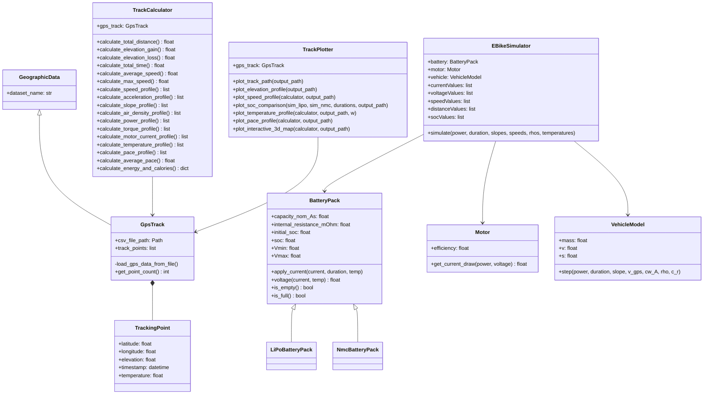

# Abschlussprojekt_LT_GR_Programmieren_I

Aufgabenstellung:
https://mrp123.github.io/MCI-MECH-B-2-PRO1-PRO1-ILV/lectures/15_abschlussprojekt/1_abschlussprojekt.html#/title-slide


---

## Umgesetzte Erweiterungen 

* **Dynamischer Temperatureinfluss**: Automatische Anpassung von Innenwiderstand und Entladeeffizienz basierend auf den echten GPS-Temperaturdaten.
* **Moving-Average-Glättung**: Rauschminderung der Temperaturaufzeichnungen mittels gleitendem Mittelwert.
* **Pace-Auswertung**: Berechnung der min/km-Pace pro Kilometer via linearer Interpolation sowie Bestimmung der Durchschnittspace.
* **Interaktive 3D-Karte**: Export des Streckenverlaufs in eine HTML-Ansicht mittels Pydeck.
* **Erweiterte Physik**: Integration von temperatur- und höhenabhängiger Luftdichte \(\rho\) sowie des Rollwiderstands \(c_r\).
* **Energie- & Kalorienrechner**: Aufteilung zwischen biologischer Eigenleistung (kcal) und elektrischer Motorarbeit (Wh).
* **Interaktives GUI-Dashboard**: Abschlussfenster (CustomTkinter) mit Klick-Verknüpfung zum Öffnen aller Diagramme.
* **Automatische Unit-Tests**: 12 automatisierte Testfälle zur Absicherung der Berechnungslogik.

---

## Quellen zu verwendeten Inhalten

* **Entfernungsberechnung (Haversine-Formel)**: [Wikipedia - Haversine Formula](https://en.wikipedia.org/wiki/Haversine_formula) (zur Berechnung des Abstands zwischen zwei Geokoordinaten auf einer Kugel).
* **Luftdichtebestimmung (Barometrische Höhenformel)**: [Wikipedia - Barometric Formula](https://en.wikipedia.org/wiki/Barometric_formula) (zur Höhen- und Temperaturabhängigkeit der Luftdichte).
* **Fahrphysikalisches Modell**: Grundlagen der Fahrzeugtechnik (Fahrwiderstandsgleichungen für Steigungs-, Luft- und Rollwiderstand).
* **Bibliotheken**: CustomTkinter (GUI-Layout), Pydeck (3D-Visualisierung), Pandas & NumPy (Datenverarbeitung), Matplotlib (Diagramme).


## Installation & Ausführung

   ```bash
   # Windows (PowerShell):
   .\.venv\Scripts\Activate.ps1

   # Pakete installieren:
   pip install -r requirements.txt 

   # Simulation starten:
   python main.py
   ```

Ablaufdiagramm:

```mermaid
flowchart TD
    %% UML Start and End Nodes
    StartNode(( )) ---> SelectFile(Select GPS CSV File via Picker)
    
    SelectFile --> ParseCSV(Parse CSV into GPS Track Points)
    ParseCSV --> CalcProfiles(Calculate Profiles: Power, Slopes, Speeds, Rhos, Temps, Pace)
    CalcProfiles --> InitSim(Initialize Vehicle, Motor, & Batteries)
    
    %% Loop Start
    InitSim --> ForEachSegment(Select Next GPS Segment)
    
    %% Decision Node (UML Diamond)
    ForEachSegment --> DecisionAkku{ }
    
    %% Decision Labels as Guards [Condition]
    DecisionAkku -->|"[SoC > 0%]"| CalcCurrent(Calculate Motor Current Draw)
    CalcCurrent --> Discharge(Apply Current & Discharging Rate)
    Discharge --> CalcVoltage(Calculate Effective Voltage)
    CalcVoltage --> VehicleStep(Simulate Vehicle Physical Step)
    
    DecisionAkku -->|"[SoC <= 0%]"| ZeroPower(Set Motor Power to 0)
    ZeroPower --> VehicleStep
    
    %% Loop Condition check
    VehicleStep --> NextSegment{ }
    NextSegment -->|"[Has more segments]"| ForEachSegment
    
    %% Post-simulation
    NextSegment -->|"[End of route]"| CalcEnergy(Calculate Energy & Calorie Metrics)
    CalcEnergy --> GeneratePlots(Generate PNG Plots & Interactive 3D Map)
    GeneratePlots --> ShowGUI(Show CustomTkinter Dashboard Window)
    
    %% GUI Interaction Loop
    ShowGUI --> UserChoice{ }
    UserChoice -->|"[Click chart button]"| OpenPlot(Open Chart File in OS Viewer)
    OpenPlot --> ShowGUI
    UserChoice -->|"[Click Close]"| EndNode
    
    EndNode((( )))
    
    %% Styles to match UML standard
    style StartNode fill:#000,stroke:#000,width:20px,height:20px
    style EndNode fill:#000,stroke:#000,stroke-width:4px,width:20px,height:20px
    style DecisionAkku fill:#fff,stroke:#000,width:30px,height:30px
    style NextSegment fill:#fff,stroke:#000,width:30px,height:30px
    style UserChoice fill:#fff,stroke:#000,width:30px,height:30px
```




---

## 📊 Softwarestruktur (UML Klassendiagramm)



